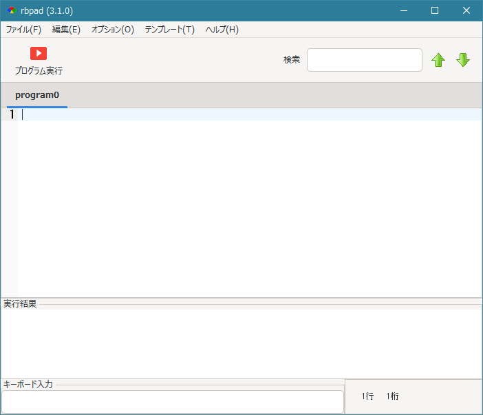
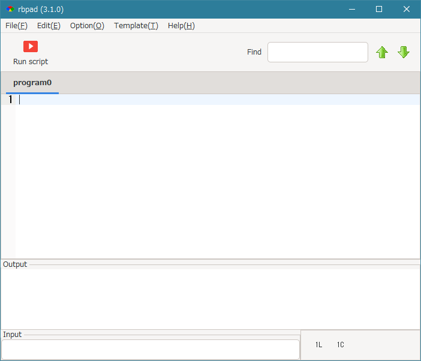

# rbpad

'rbpad' is a programming editor for Ruby,  
you are able to edit and run scripts of Ruby easily.  

## Required

'rbpad' has depended on Ruby/GTK3 and Ruby/GtkSourceView3.  

## Installation

Install it yourself as:  

    $ gem install gtksourceview3  
    $ gem install rbpad  

## Usage

Type following.  

    $ rbpad                            # Japanese mode

&nbsp; &nbsp; &nbsp; 

With '-e' option, labels are shown as English.  

    $ rbpad -e                         # English mode  

&nbsp; &nbsp; &nbsp; 

With '-x' option, run as maximum window size.  
Or give 'width' and 'height' argument, can run as specified window size.  

    $ rbpad -x                         # maximum window size  
    $ rbpad 1000 800                   # screen size is 1000 x 800  

Default size is 800 x 650.  

## Documents

[https://github.com/spoolkitamura/rbpad3-doc-jp/wiki](https://github.com/spoolkitamura/rbpad3-doc-jp/wiki) (Japanese)  
[https://github.com/spoolkitamura/rbpad3-doc-en/wiki](https://github.com/spoolkitamura/rbpad3-doc-en/wiki) (English)  

## License

The gem is available as open source under the terms of the [MIT License](https://opensource.org/licenses/MIT).  

